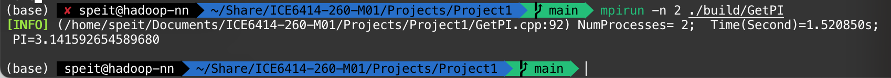
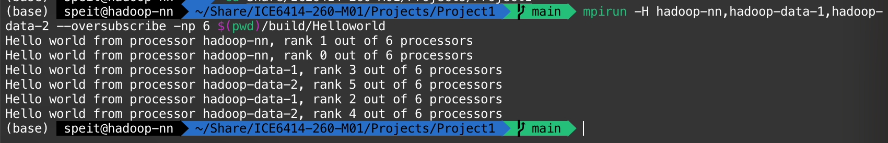

# Helloworld & GetPI

## Installing MPI

对于Ubuntu系统你可以在[mpich](https://packages.ubuntu.com/focal/mpich)找到有关mpich包的信息

```console
sudo apt-get install mpich
sudo make install
```

或者手动下载并编译MPICH

```console
wget https://www.mpich.org/static/downloads/4.0/mpich-4.0.tar.gz
tar -xvf mpich-4.0.tar.gz
./configure
make
```

如果手动安装，则需要配置MPI_ROOT变量

```zsh
export MPI_ROOT=$BUILD_DIR
export PATH=$MPI_ROOT/bin:$PATH
export MANPATH=$MPI_ROOT/man:$MANPATH
```

`$BUILD_DIR`是编译MPI的目录

## Build MPI Porject

你可以通过如下的`CMakeLists.txt`文件组织MPI工程

```cmake
project(Hellowrold CXX)
set(CMAKE_CXX_COMPILER "/usr/bin/mpicxx")
include_directories(...)
add_executable(...)
```

或者用

```console
mpicxx Helloworld.cpp -o Helloworld
```

命令进行编译

## Tutorial

可以参考这个Tutorial

[mpitutorial](https://github.com/mpitutorial/mpitutorial)

## Helloworld

为了完成Helloworld，我们设计了一个类来获取进程的Rank和Size。

```c++

class MPIProcessorInfo {
public:
    MPIProcessorInfo() {
        MPI_Comm_size(MPI_COMM_WORLD, &_iWorldSize); // Get WorldSize = number of parallel processes
        MPI_Comm_rank(MPI_COMM_WORLD, &_iWorldRank); // Get World Rank = idx of current process

        char acProcessorName[MPI_MAX_PROCESSOR_NAME]; // Temperory variable for  Processor name
        int iNameLen;
        MPI_Get_processor_name(acProcessorName, &iNameLen);
        _ProcessorName = std::string(acProcessorName);

    }

    std::string sName() {
        return _ProcessorName;
    }

    const char * acName() {
        return _ProcessorName.c_str();
    }
    int iSize() const {
        return _iWorldSize;
    }
    int iRank() const {
        return _iWorldRank;
    }

    
protected:
    int _iWorldSize = 0;
    int _iWorldRank = 0;
    std::string _ProcessorName;
};
```

因此在Hellworld里，我们可以通过类的方法来确定WorldSize, Rank

```c++
#include <iostream>
#include <mpi.h>
#include "ProcessorInfo.hpp"


int main(int argc, char ** argv) {
    MPI_Init(nullptr, nullptr);

    /** Get Current Processor Name **/
    MPIProcessorInfo Processor;

    printf("Hello world from processor %s, rank %d out of %d processors\n", Processor.acName(), Processor.iRank(), Processor.iSize());

    // 释放 MPI 的一些资源
    MPI_Finalize();
}
```

## GetPI

我们有

$$ \pi =\int_0^1\frac{4}{(1+x^2)} $$

令每个进程计算一部分积分的结果，然后将结果加起来就是$pi$了

我们使用两种思路解决这个问题：

- 使用MPI_Reduce自动将结果求和
- 使用MPI_Send/MPI_Recv手动实现通讯

两个思路分别体现在了`GetPIMapReduce()`和`GetPISendRecv()`函数中

## Demo

使用`./run.sh`来编译代码并运行。

> 如果手动运行，则首先用`cmake .`创建工程，然后用`make` 编译，最后用`mpirun -n <N>`执行



## On Clusters

首先，确保当前目录已经通过NFS共享挂载到了集群的各节点上，并且各节点都已经配置了免密钥登录和MPI，然后执行下面的命令

```shell
mpirun -H hadoop-nn,hadoop-data-1,hadoop-data-2 --oversubscribe -np 6 $(pwd)/build/Helloworld
```

- hadoop-nn,hadoop-data-1,hadoop-data-2是集群节点的主机名


