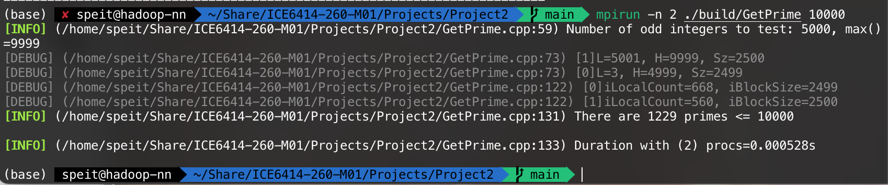

# GetPrime

## Introductin

本程序使用MPI加速质数筛选法来获得指定范围内质数的个数。

## Get Started

可以运行`run.sh`查看$100000$以内的质数个数，也可以手动编译工程：

```shell
mkdir build && cd build
cmake ..
make
```

执行程序，传入一个整数$N$作为参数，程序会计算N以内的素数个数

```shell
mpirun -n 4 ./build/GetPrime N
```

## Experiment


