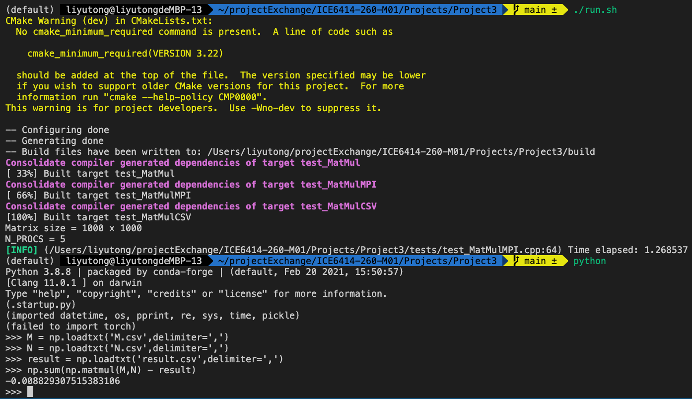
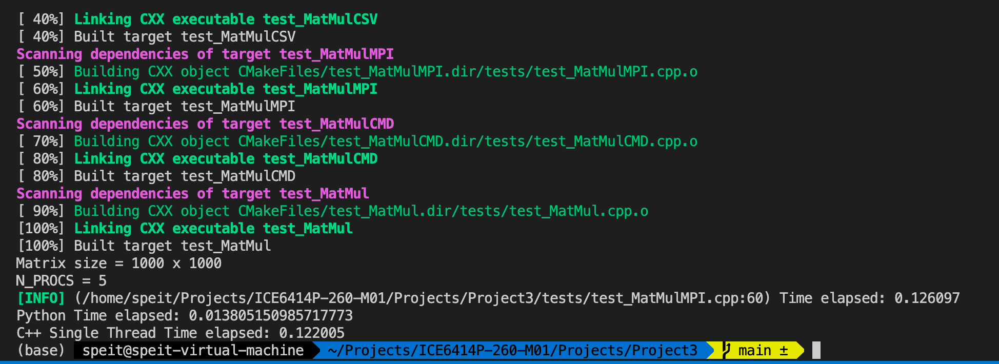

# MatMul

## Introduction

本程序用MPI加速矩阵乘法

- `include/block.hpp` 计算Block大小的宏
- `include/debug.h` 格式化打印一些信息的宏
- `include/MatMul.hpp` 并行矩阵乘法的实现，可以用在MPI，也可以结合Fork使用
- `include/Matrix.hpp` 实现了非并行化的矩阵操作，包括赋值、乘法、取行、读取、写入。
- `include/MPIProcessorInfo.hpp` 包装了获取Rank的一些函数
- `MPITimer.hpp` 计时类

## Get Started

运行`./run.sh`可以执行实验。脚本首先使用python3的numpy包生成随机矩阵并保存到文本文件中:

```python
import numpy as np
import sys

problem_size = int(sys.argv[1]) if len(sys.argv) > 1 else 1000
M = np.random.randn(problem_size,problem_size)
N = np.random.randn(problem_size,problem_size)
np.savetxt('N.csv',N, delimiter=',')
np.savetxt('M.csv',M, delimiter=',')
```

该命令位于第16行。如果没有python3，请编辑脚本注释掉该语句，并手动生成测试用的矩阵文件。这些文件遵循逗号分隔符文件的格式，并且每行的元素个数必须相同

```csv
-1.906823460215680610e+00,-2.383109902819825709e+00,-4.338918887563131266e-02,-1.334806655702789890e-01,
-2.479051114134289413e-01,8.046796340265147673e-01,8.635744639676885548e-01,-1.172935703596474089e-01,
-1.741519129067210070e+00,-1.622521002155592695e+00,-1.229968089951235966e+00,1.337246387572335882e-01,
-2.625565051736974187e+00,-1.752497090728647677e+00,1.177944274777703304e-01,-1.412145634324654786e+00,
3.176910794514529179e-01,1.480899147242159986e+00,-1.111538115652460079e-01,1.411553316028739014e+00,
3.148710887588545559e-01,1.566847134791984342e+00,-1.179959451502980983e+00,-4.458292347380900245e-02,
-3.951515770017132168e-01,-4.967120500906663794e-01,1.854050026702771803e-01,-2.493979774108322722e+00,
-1.441138681107004826e+00,1.221831984647416408e-01,1.293982238109329552e+00,5.240601309541558228e-01,
-7.165608687684461575e-01,1.582920483697240144e+00,1.146747862429982501e+00,1.207939545985466268e+00,
```

创建两个尺寸匹配的矩阵后，将他们保存在磁盘上。然后编译工程

```shell
mkdir build && cd build
cmake ..
make
```

若要执行计算，请用mpirun执行程序，并传入四个参数

```shell
mpirun -n $N_PROCS ./build/test_MatMulMPI $MAT1 $MAT2 $RESULT
```

- `$N_PROCS` 为并行的进程数
- `$MAT1` `$MAT2`为矩阵文件
- $MAT_1\cdot MAT_2$ 的结果将保存在`$RESULT`中

## Experiment

通过执行`run.sh`，我们可以一次执行三个实验

- MPI并行
- Python Numpy
- C++单线程

所有实验都是对测试1k * 1k 矩阵相乘。N_PROC默认值为5，即4个工作进程，一个分发进程。



可以看到，MPI程序相对有一定的加速比。然而，这个速度远远不及NumPy. NumPy实现了访存优化，比我们的MPI实现要优秀的多。（可以用`python ./test_numpy_matmul.py`替换命令对矩阵文件执行乘法）

```shell
python ./test_numpy_matmul.py M.csv N.csv result.csv
```

## SIMD 优化

`src/gemm.cpp`实现了float/double类型的通用矩阵乘法。该乘法使用了AVX指令集加速。

通过修改run.sh中的USE_AVX变量，我们可以为整个实验开启AVX支持。

```bash
USE_AVX=1
```

加入AVX后，程序的速度提升了4倍。但是我们发现MPI的加速比为负数。这可能是因为我们在一台主机上开多进程，导致多个进程同时访问处理器AVX寄存器，反而降低了效率。

