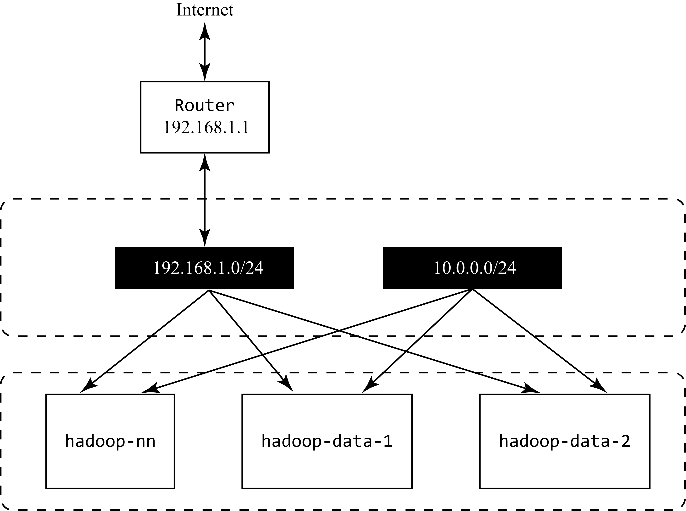
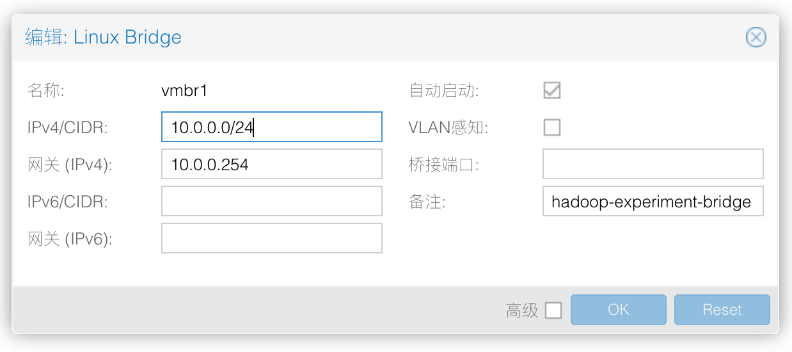
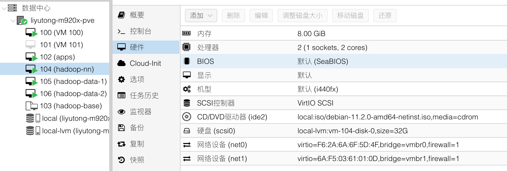
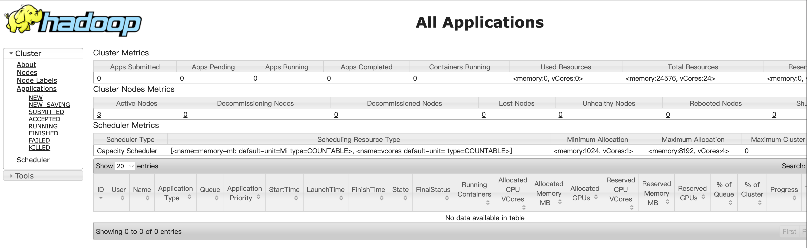
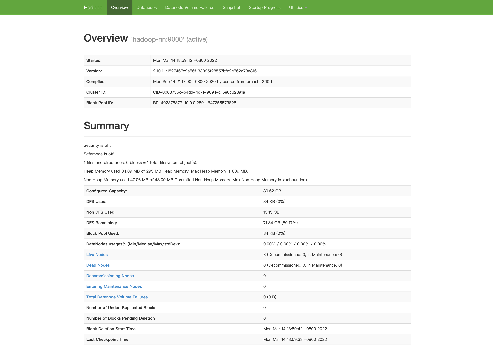
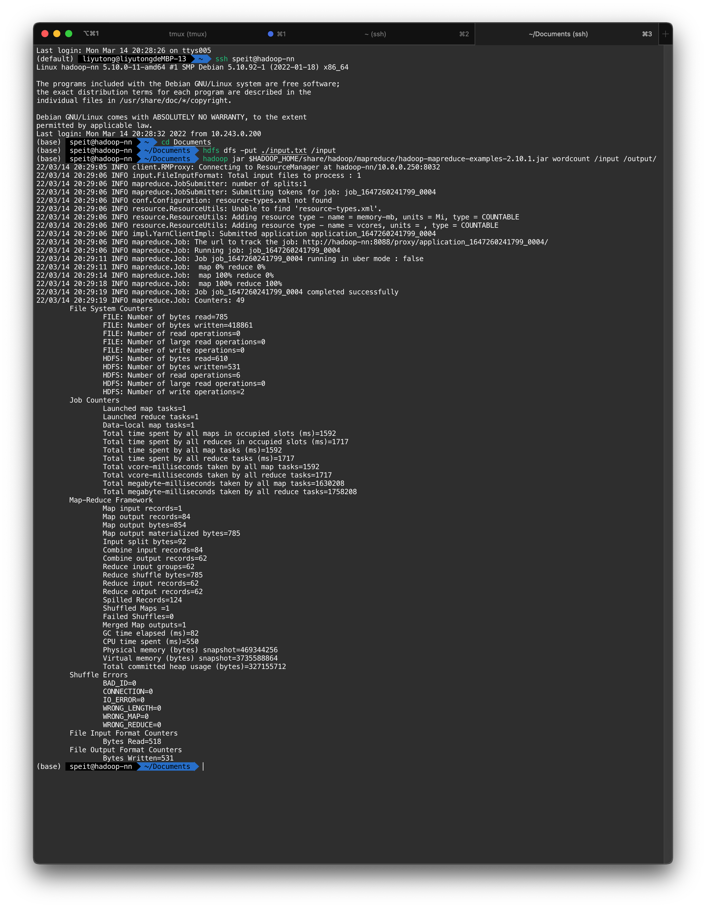
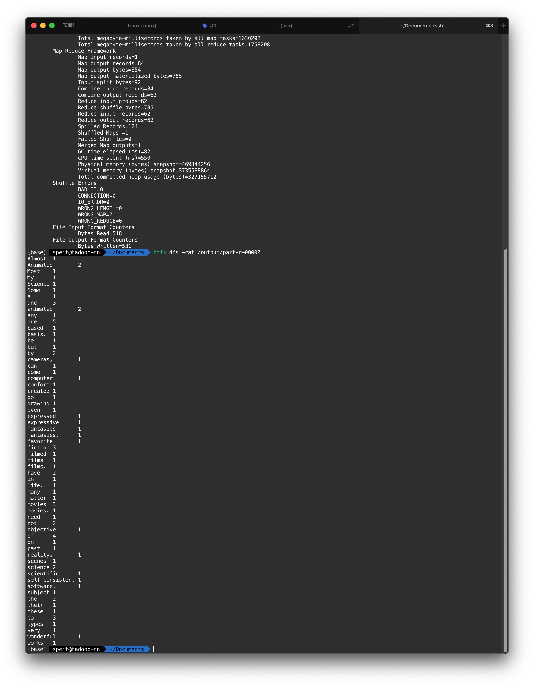

# Hadoop

Author: davidliyutong

Reference:

- [Hadoop Java](https://tjxlab.gitbooks.io/bigdata/content/da-shu-ju-ji-zhu-ji-chu-shi-yan/hadoopji-chu-shi-yan/shi-yan-yi-ff1a-hadoop-an-zhuang-yu-pei-zhi-shi-yan.html)
- [Hadoop 安装与测试](https://cloud.tencent.com/document/product/436/10867)

## Setup

本文基于Debian 5.10.92 系统。架构为`x86_64`

> [下载Debian](https://www.debian.org/download)

基于`Hadoop2.10.1` + `Java 1.8.0_322`进行部署

整个集群包括三台虚拟机：

| 主机名          | 角色                               | IP         |
| --------------- | ---------------------------------- | ---------- |
| `hadoop-nn`     | NameNode, SecondNameNode, DataNode | 10.0.0.250 |
| `hadoop-data-1` | DataNode                           | 10.0.0.1   |
| `hadoop-data-2` | DataNode                           | 10.0.0.2   |

网络拓扑如下，每个虚拟机有两张网卡分别负责连接互联网和Hadoop集群的其他节点


所有操作都在`speit`用户下执行，其家目录为`/home/speit`。`[speit@all]`表示命令需要在所有节点执行，[speit@hadoop-nn]，表示命令在`hadoop-nn`上执行

有关目录的一览表:

| 项目                     | 目录                              | 变量          |
| ------------------------ | --------------------------------- | ------------- |
| 家目录                   | `/home/speit/`                    | `$HOME`       |
| Java 安装目录            | `/usr/java/`                      | `$JAVA_HOME`  |
| Hadoop 安装目录          | `$HOME/hadoop`                    | `HADOOP_HOME` |
| Hadoop 临时目录          | `$HOME/hadoop-data/tmp`           |               |
| Hadoop HDFS NameNode目录 | `$HOME/hadoop-data/hdfs/namenode` |               |
| Hadoop HDFS DataNode目录 | `$HOME/hadoop-data/hdfs/datanode` |               |

### 组网

所有的虚拟机都需要分配静态地址并且能互相通讯。(如果使用的是三台物理机，则需要确保他们在一个局域网内)。最好添加一个单独的虚拟网桥/虚拟交换机用于集群内部通讯

以ProxmoxVE为例，在网络面板新建`vmbr1`网桥：



- IPv4/CIDR 一栏表示创建了`10.0.0.0`子网，子网掩码是`255.255.255.0`，可用的IP地址是`10.0.0.0 - 10.0.0.255`
- 如果不需要连接互联网，网关可以随便填写，否则填写真实的网关
- ProxmoxVE默认创建虚拟机的时候会添加一块用于联网的虚拟网卡，该网卡一般是桥接到物理端口上的。因此新创建的虚拟网卡仅用于hadoop集群内通讯



在虚拟机中添加新的网络设备，选择连接到`vmbr1`

编辑所有虚拟机的`/etc/network/interfaces`，添加如下项目

```txt
auto ens19
iface ens19 inet static
    address <IP>
    netmask 255.255.255.0
```

- ens19 是虚拟网卡的名称
- \<IP\> 用IP地址替代，例如`hadoop-nn`就是`10.0.0.250`
- netmask 填写 24位掩码
- `auto` 选项可以让网卡自动上线
- `gateway` 填写`hadoop-nn`的地

配置完成后，可以用`ifup/ifdown ens19`或者`ifconfig ens19 up/down`来控制网卡的开关

> [`NetworkManager`](https://wiki.debian.org/NetworkManager) 是Debian推荐的网络配置工具，可以了解一下

## 关闭防火墙

Debian 默认不添加任何的iptables规则，因此可以略过。相关命令如下

```bash
[speit@all] sudo iptables -L # 列出所有规则
[speit@all] sudo iptables -F # 清除所有规则
```

使用ufw的系统，可以用一下命令关闭防火墙

```bash
[speit@all] sudo ufw disable
```

hadoop-nn/hadoop-data-1/hadoop-data-2

确保服务器之间能够ping通

## 配置Hosts文件

在所有虚拟机中编辑`/etc/hosts`，添加如下项目

```txt
10.0.0.250      hadoop-nn
10.0.0.1        hadoop-data-1
10.0.0.2        hadoop-data-2
```

测试各个主机之间能否通讯

```bash
[speit@hadoop-nn] ping hadoop-data-1
```

> **注意**
> 不要添加额外的hosts配置，例如在`hadoop-data-1`上，不要添加
>
> ```text
> 127.0.0.1 hadoop-data-1
> ```
>
> 会导致其他`hadoop-data-1`节点无法访问hadoop-nn

## 配置SSH无密码登陆

在hadoop-nn上创建ssh密钥对

```bash
[speit@hadoop-nn] ssh-keygen
```

密钥对会存储到`$HOME/.ssh/id_rsa.pub`/`$HOME/.ssh/id_rsa`。需要将将`$HOME/.ssh/id_rsa.pub`添加到所有主机的`$HOME/.ssh/authorized_keys`中以实现免密登陆

```bash
[speit@hadoop-nn] ssh-copy-id -i ~/.ssh/id_rsa.pub speit@hadoop-data-1
[speit@hadoop-nn] ssh-copy-id -i ~/.ssh/id_rsa.pub speit@hadoop-data-2
```

> 可能需要在目标主机修改`/etc/ssh/sshd_config`以允许使用密钥对登陆
>
> ```ini
> PubkeyAuthentication yes
> AuthorizedKeysFile .ssh/authorized_keys
> ```

## 安装JDK

从[Azul](https://www.azul.com/downloads/)下载Zulu8。下载地址：[https://cdn.azul.com/zulu/bin/zulu8.60.0.21-ca-jdk8.0.322-linux_x64.zip](https://cdn.azul.com/zulu/bin/zulu8.60.0.21-ca-jdk8.0.322-linux_x64.zip)

```bash
[speit@all] wget https://cdn.azul.com/zulu/bin/zulu8.60.0.21-ca-jdk8.0.322-linux_x64.zip
```

解压缩，并移动到`/usr/java`，确认`/usr/java`中的内容

```bash
[speit@all] unzip zulu8.60.0.21-ca-jdk8.0.322-linux_x64.zip
[speit@all] mv zulu8.60.0.21-ca-jdk8.0.322-linux_x64 /usr/java
[speit@all] ls /usr/java
ASSEMBLY_EXCEPTION  bin  CLASSPATH_EXCEPTION_NOTE  demo  DISCLAIMER  include  jre  lib  LICENSE  man  readme.txt  release  sample  src.zip  THIRD_PARTY_README  Welcome.html
```

> `/usr/java`即当前Java的安装目录，`/usr/java/bin/java`为Java二进制程序

确认Java安装成功

```bash
[speit@all] /usr/java/bin/java -version
openjdk version "1.8.0_322"
OpenJDK Runtime Environment (Zulu 8.60.0.21-CA-linux64) (build 1.8.0_322-b06)
OpenJDK 64-Bit Server VM (Zulu 8.60.0.21-CA-linux64) (build 25.322-b06, mixed mode)
```

## 安装Hadoop

我们暂时只在`hadoop-nn`上配置hadoop安装实例。配置完成后，我们用用`scp`命令将hadoop实例同步到其他节点上去

从SJTU 镜像站下载Hadoop 2.10.1

```bash
[speit@hadoop-nn] wget https://mirror.sjtu.edu.cn/apache/hadoop/common/hadoop-2.10.1/hadoop-2.10.1.tar.gz
[speit@hadoop-nn] tar -xf hadoop-2.10.1.tar.gz
[speit@hadoop-nn] mv ./hadoop-2.10.1 /home/speit/hadoop
```

## 配置Hadoop

Hadoop的配置文件保存在`$HADOOP_HOME/etc/hadoop/`下，它们是：

- hadoop-env.sh
- core-site.xml
- hdfs-site.xml
- mapred-site.xml (可能需要创建)
- yarn-site.xml
- yare-env.sh

### `$HADOOP_HOME/etc/hadoop/hadoop-env.sh`

在文件头部添加：

```txt
# >>> hadoop >>>
export JAVA_HOME=/usr/java
export PATH=$JAVA_HOME/bin:$PATH
export HADOOP_HOME=/home/speit/hadoop
export PATH=$PATH:$HADOOP_HOME/bin
export PATH=$PATH:$HADOOP_HOME/sbin
# <<< hadoop <<<
```

### `$HADOOP_HOME/etc/hadoop/core-site.xml`

```xml
<configuration>
  <property>
    <name>fs.defaultFS</name>
    <value>hdfs://hadoop-nn:9000</value>
  </property>
  <property>
    <name>hadoop.tmp.dir</name>
    <value>/home/speit/hadoop-data/tmp</value>
  </property>
</configuration>
```

> `hadoop.tmp.dir` 需要存在
> 9000为ResourceManager的端口，可以通过浏览器访问`http://hadoop-nn:9000`

### `$HADOOP_HOME/etc/hadoop/hdfs-site.xml`

```xml
<configuration>
  <property>
    <name> dfs.namenode.secondary.http-adress</name>
    <value>hadoop-nn:9001</value>
  </property>
  <property>
    <name>dfs.namenode.name.dir</name>
    <value>/home/speit/hadoop-data/hdfs/namenode</value>
  </property>
  <property>
    <name>dfs.datanode.data.dir</name>
    <value>/home/speit/hadoop-data/hdfs/datanode</value>
  </property>
  <property>
    <name>dfs.replication</name>
    <value>3</value>
  </property>
</configuration> 
```

> `dfs.namenode.name.dir` 和 `dfs.datanode.data.dir` 必须在欲运行NameNode/DataNode的主机上存在

### `$HADOOP_HOME/etc/hadoop/mapred-site.xml`

> 可能需要创建该文件

```xml
<configuration>
    <property>
        <name>mapreduce.framework.name</name>
        <value>yarn</value>
    </property>
</configuration> 
```

使用YARN组件进行调度

### `$HADOOP_HOME/etc/hadoop/yarn-site.xml`

```xml
<configuration>
  <!-- Site specific YARN configuration properties -->
  <property>
    <name>yarn.resourcemanager.hostname</name>
    <value>hadoop-nn</value>
  </property>
  <property>
    <name>yarn.nodemanager.aux-services</name>
    <value>mapreduce_shuffle</value>
  </property>
  <property>
    <name>yarn.resourcemanager.webapp.address</name>
    <value>hadoop-nn:8088</value>
  </property>
</configuration>
```

> 8088为ResourceManager的端口，可以通过浏览器访问`http://hadoop-nn:8088`

### `$HADOOP_HOME/etc/hadoop/slaves`

```txt
hadoop-nn
hadoop-data-1
hadoop-data-2
```

> slaves 中的主机上将会运行DataNode

### `$HADOOP_HOME/etc/hadoop/yarn-env.sh`

在头部添加

```text
export JAVA_HOME=/usr/java
```

## 分布式部署

### Hadoop

将配置好的hadoop实例复制到所有的节点上去：

```bash
[speit@hadoop-nn] scp -rp /home/speit/hadoop speit@hadoop-data-1:/home/speit/hadoop
[speit@hadoop-nn] scp -rp /home/speit/hadoop speit@hadoop-data-2:/home/speit/hadoop
```

### Hadoop-Data

在`hadoop-nn`上像这样创建目录:

```text
/home/speit/hadoop-data
├── hdfs
│   ├── datanode
│   └── namenode
└── tmp
```

命令：

```bash
[speit@hadoop-nn] mkdir /home/speit/hadoop-data/
[speit@hadoop-nn] mkdir /home/speit/hadoop-data/tmp 
[speit@hadoop-nn] mkdir /home/speit/hadoop-data/hdfs 
[speit@hadoop-nn] mkdir /home/speit/hadoop-data/hdfs/data 
[speit@hadoop-nn] mkdir /home/speit/hadoop-data/hdfs/name
```

将该目录复制到所有节点上去

```bash
[speit@hadoop-nn] scp -rp /home/speit/hadoop-data speit@hadoop-data-1:/home/speit/hadoop-data
[speit@hadoop-nn] scp -rp /home/speit/hadoop-data speit@hadoop-data-2:/home/speit/hadoop-data
```

### 设置环境变量

在**所有虚拟机**上，修改`/etc/profile`，添加

```bash
# >>> hadoop >>>
export JAVA_HOME=/usr/java
export PATH=$JAVA_HOME/bin:$PATH
export HADOOP_HOME=/home/speit/hadoop
export PATH=$PATH:$HADOOP_HOME/bin
export PATH=$PATH:$HADOOP_HOME/sbin
# <<< hadoop <<<
```

> **注意**
> `/etc/profile`控制的是全局环境变量。和`~/.bashrc`（用户环境变量）不同。
> Hadoop在分布式节点上的执行依赖全局环境变量。


重新登陆`hadoop-nn`以应用更改

## 启动

在`hadoop-nn`节点上，格式化HDFS存储

```bash
[speit@hadoop-nn] hadoop namenode -format
```

启动HDFS系统

```bash
[speit@hadoop-nn] $HADOOP_HOME/sbin/start-dfs.sh
```

> 日志文件默认保存在`$HADOOP_HOME/logs/`下

启动YARN系统

```bash
[speit@hadoop-nn] $HADOOP_HOME/sbin/start-yarn.sh
```

> 日志文件默认保存在`$HADOOP_HOME/logs/`下

## 验证

### 验证进程

使用`jps`查看Hadoop进程（查看java进程）

```bash
[speit@hadoop-nn] jps
29553 NodeManager
29284 SecondaryNameNode
28981 NameNode
29461 ResourceManager
1719 XMLServerLauncher
39015 Jps
29119 DataNode

[speit@hadoop-data-1] jps
13040 Jps
12770 DataNode
12863 NodeManager

[speit@hadoop-data-2] jps
8725 NodeManager
8632 DataNode
8924 Jps
```

> 不同的节点上应该有不同的进程运行

### 验证Web服务

使用终端命令`lynx http://hadoop-nn:8088`或者在浏览器地址栏里输入`http://hadoop-nn:8088` 可以访问YARN

```bash
[speit@hadoop-data-2] lynx http://hadoop-nn:8088
```



使用终端命令`lynx http://hadoop-nn:50070`或者在浏览器地址栏里输入`http://hadoop-nn:50070` 可以访问HDFS网站

```bash
[speit@hadoop-data-2] lynx http://hadoop-nn:50070
```



### 验证MapReduce

> My favorite types of movies are science fiction and animated movies. Science fiction movies are based on many wonderful fantasies. Most of these fantasies have a self-consistent scientific basis. Some of the science fiction works of the past have even come to life. Animated movies are not filmed by cameras, but are created by drawing and computer software. Animated films are very expressive and their scenes do not need to conform to objective reality. Almost any subject matter can be expressed in animated films.

创建`input.txt`， 内容如上

```bash
[speit@hadoop-data-2] echo "..." > input.txt
```

在HDFS上创建`/input`目录，并放入`input.txt`

```bash
[speit@hadoop-data-2] hdfs dfs -mkdir /input
[speit@hadoop-data-2] hdfs dfs -put ./input.txt /input
```

运行示例WordCount程序

```bash
[speit@hadoop-data-2] hadoop jar $HADOOP_HOME/share/hadoop/mapreduce/hadoop-mapreduce-examples-2.10.1.jar wordcount /input /output/
```



查看结果

```bash
[speit@hadoop-data-2] hdfs dfs -ls /output
Found 2 items
-rw-r--r--   3 speit supergroup          0 2022-03-14 20:18 /output/_SUCCESS
-rw-r--r--   3 speit supergroup        531 2022-03-14 20:18 /output/part-r-00000
[speit@hadoop-data-2] hdfs dfs -cat /output/part-r-00000
```



## 其他

修改Hadoop配置文件后后最好删除hadoop-data目录，重新格式化HDFS文件系统

用于参考的配置文件在`/etc/haddop`目录下

## Spark 安装

### 下载Spark

从[Spark 下载](https://spark.apache.org/downloads.html)

> 下载预编译的Spark前需要确认版本匹配。Hadoop2.10可视为Hadoop2.7

```bash
[speit@hadoop-nn] wget https://dlcdn.apache.org/spark/spark-3.2.1/spark-3.2.1-bin-hadoop2.7.tgz
[speit@hadoop-nn] tar -xf spark-3.2.1-bin-hadoop2.7.tgz
```

### 安装Spark

有关目录的一览表:

| 项目           | 目录           | 变量          |
| -------------- | -------------- | ------------- |
| 家目录         | `/home/speit/` | `$HOME`       |
| Spark 安装目录 | `$HOME/spark`  | `$SPARK_HOME` |

我们意图将Spark安装到`/home/speit/spark`下，因此

```bash
[speit@hadoop-nn] mv spark-3.2.1-bin-hadoop2.7 ~/spark
```

将以下内容添加到终端配置文件`~/.bashrc`或者`~/.zshrc`中

```bash
# >>> spark >>>
export SPARK_HOME=$HOME/spark/
export PATH=$SPARK_HOME/bin:$PATH
# <<< spark <<<
```

重新载入终端配置文件（以`zsh`为例）

```bash
[speit@hadoop-nn] source ~/.zshrc
```

### 测试Spark

安装python

```bash
[speit@hadoop-nn] sudo apt-get install python3 python3-pip
```

测试`pyspark`命令

```text
[speit@hadoop-nn] pyspark
Python 3.9.7 (default, Sep 16 2021, 13:09:58)
[GCC 7.5.0] :: Anaconda, Inc. on linux
Type "help", "copyright", "credits" or "license" for more information.
Using Spark's default log4j profile: org/apache/spark/log4j-defaults.properties
Setting default log level to "WARN".
To adjust logging level use sc.setLogLevel(newLevel). For SparkR, use setLogLevel(newLevel).
22/03/18 14:46:16 WARN NativeCodeLoader: Unable to load native-hadoop library for your platform... using builtin-java classes where applicable
Welcome to
      ____              __
     / __/__  ___ _____/ /__
    _\ \/ _ \/ _ `/ __/  '_/
   /__ / .__/\_,_/_/ /_/\_\   version 3.2.1
      /_/

Using Python version 3.9.7 (default, Sep 16 2021 13:09:58)
Spark context Web UI available at http://hadoop-nn:4040
Spark context available as 'sc' (master = local[*], app id = local-1647585977373).
SparkSession available as 'spark'.
>>>
```

Spark可以运行
